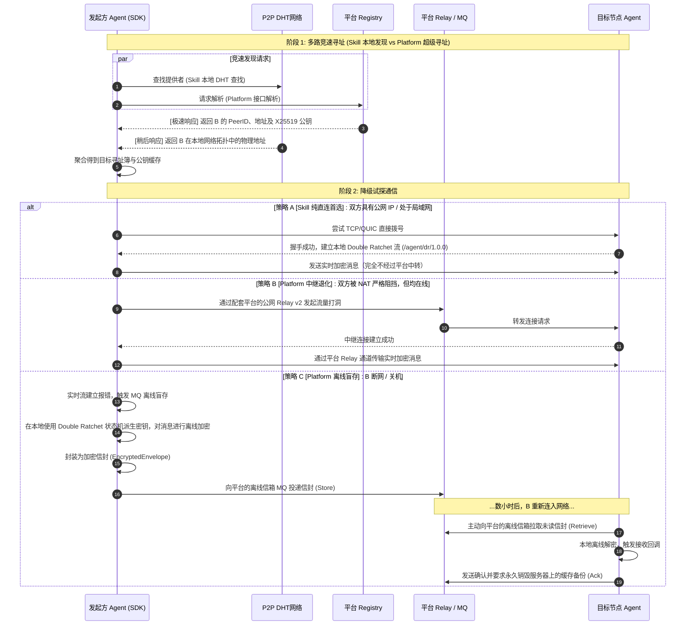

# agent-comm 开发与架构设计总览 🛠️

本文档专门面向**开发者与系统贡献者**。它描述了 `agent-comm` 系统的技术架构、核心密码学设计、降级策略、项目代码布局、以及本地编译测试流程。

如果您只是该通信套件的普通使用者或集成商，请先阅读 **[用户使用指南 (README.md)](README.md)**。

---

## 🧭 开发者文档地图 (Documentation Directory Map)

项目提供了分层、递进的文档体系，建议按照以下路线进行阅读：

1. **整体概览**：即本文档（[OVERVIEW.md](OVERVIEW.md)），了解项目全貌与本地开发调试。
2. **应用 SDK 封装设计**：阅读 **[AGENT_SKILL_DESIGN.md](docs/AGENT_SKILL_DESIGN.md)**，了解高阶客户端 SDK（`agent/` 目录）的路由降级与会话封装逻辑。
3. **云端基础设施设计**：阅读 **[PLATFORM_DESIGN.md](docs/PLATFORM_DESIGN.md)**，了解配套公共平台 **[agent-comm-platform](https://github.com/BillShiyaoZhang/agent-comm-platform)** 提供的超级 Registry、Relay 集群、MQ 盲存服务的设计及合规网关代理。
4. **通信与加密协议规格书**：阅读 **[SPEC.md](SPEC.md)**，这是系统 Phase 1 至 Phase 6 的协议级物理定义文件（数据包格式、消息帧、AAD定义等）。
5. **基础背景与原理教程**：阅读 **[TUTORIAL.md](docs/TUTORIAL.md)**，适合需要补充 P2P、Relay v2、Kademlia DHT 或密码学密钥协商背景的开发者。
6. **双棘轮代码逐文件批注**：阅读 **[DR-CODE-COMMENTARY.md](docs/DR-CODE-COMMENTARY.md)**，深入理解 `dr/` 目录中 Double Ratchet 会话与状态持久化的 Go 语言实现细节。

---

## 🏗️ 核心架构与技术栈

`agent-comm` 由本地客户端 SDK 模块（纯 Skill）以及云端配套基础设施 **[agent-comm-platform](https://github.com/BillShiyaoZhang/agent-comm-platform)** 协同构建。

### 密码学与网络协议栈划分：

| 层次 | 技术 | 运行边界划分与作用 |
|------|------|------------------|
| **网络传输** | libp2p + Relay v2 | **[纯 Skill 本地功能]** 点对点物理连接协商；若双方不可达，则 **[需 Platform 配合]** 由中继节点转发 |
| **寻址路由** | Kademlia DHT + 超级 Registry | **[纯 Skill 本地功能]** DHT 节点寻址；**[需 Platform 配合]** 由平台的 Registry 进行极速并行解析 |
| **节点身份** | Ed25519 | **[纯 Skill 本地功能]** 密钥生成自证明身份 URN (Uniform Resource Name，统一资源名称)，完全保密 |
| **密钥交换** | X25519 ECDH + HKDF | **[纯 Skill 本地功能]** 初始一次性会话会商 ECIES 加密密钥 |
| **消息加密** | AES-GCM-SIV + Double Ratchet | **[纯 Skill 本地功能]** 状态机密钥推导演进，实现前向保密的“一文一密” |
| **离线暂存** | Platform MQ + SQLite | **[需 Platform 配合]** 消息信封的异步盲存，中继对消息明文完全不可见 |

---

## 🔄 混合降级路由机制 (Hybrid P2P Flow)

高阶 SDK（`agent/`）内置了降级流转时序。根据当前的网络可达状态，系统会在 **纯 Skill 直连模式** 与 **Platform 辅助模式** 之间自动流转：



---

## 🗂️ 项目代码目录导航

```
agent-comm/
├── agent/           # 🎁 高阶封装 SDK 门面（InitIdentity, SendMessage, OnMessage, 名片导入导出）
├── crypto/          # 🔐 Ed25519/X25519 密钥工具箱与 ECIES 编解码实现
├── libp2p/          # 🌐 基于 libp2p.Host 的底层基础网络节点构造
├── dht/             # 📍 Kademlia DHT 协议查询/分发封装（本地 Skill）
├── registry/        # 📇 寻址目录服务（client 侧本地解析，及 server 侧服务，服务属于 Platform）
├── session/         # 📁 ECIES 临时加密会话管理
├── mq/              # 📥 离线消息信箱（client 侧本地拉取，及基于 SQLite 的 server 存储，存储属于 Platform）
├── dr/              # 🔄 Double Ratchet 核心状态机算法、持久化层（SQLite）及网络流处理器
├── wot/             # 🤝 信任网络（Web of Trust）模块（本地 Skill）
├── contacts/        # 📇 本地已信任的联系人通讯录持久化管理
├── proto/           # 🧬 Protobuf 消息契约定义文件 (.proto 及自动生成的 Go 接口)
└── cmd/             # 🛠️ 命令行入口与单元/集成测试
    ├── bootstrap/   # 平台专属：云端公共 Bootstrap 节点服务启动程序 (属于 Platform)
    ├── client/      # 交互式 CLI 通信客户端
    └── test_*/      # 各 Phase 独立的功能测试程序
```

---

## 🛠️ 本地编译与测试指南

运行测试前，请确保您本地已安装 Go（推荐 Go 1.25.10 及以上）。

### 1. 运行本地纯 Skill 各 Phase 单元/模拟测试（无需云端平台部署）

```bash
# 进入项目工作区
cd <agent-workspace>/agent-comm

# Phase 1: 测试 libp2p 主机创建与网络发现
go run ./cmd/test_host/

# Phase 2: 测试两节点 ECIES 加密会话（带内握手）
go run ./cmd/test_session/

# Phase 5: 测试 Double Ratchet 状态持久化（SQLite 写入与重启恢复）
go run ./cmd/test_dr_persist/

# Phase 6: 测试两节点通过 libp2p stream 进行双棘轮加密双向通信
go run ./cmd/test_dr_net/
```

### 2. 运行需要结合 Platform 中继/信箱的集成测试

```bash
# Phase 3: 测试三节点离线消息暂存（需要 Relay 节点模拟 MQ 信箱中转）
go run ./cmd/test_mq/

# 运行已部署平台（ECS）完整连通性集成测试
go run ./cmd/platform_test/
```

> [!NOTE]
> **配套公共 Platform 配置信息**（详情参考 **[agent-comm-platform](https://github.com/BillShiyaoZhang/agent-comm-platform)** 仓库）：
> - **公网域名**：`agent-communication.online`
> - **平台 PeerID**：`12D3KooWJVLmsJZvHoKYcQDDTWwf1mvqLxfZTceHU5N7t27j6Rvn`
> - **平台 URN**：`urn:hermes:platform:ee8be13add63a020`
> - **推荐 P2P QUIC 引导地址**：`/dns4/agent-communication.online/udp/45041/quic-v1/p2p/12D3KooWJVLmsJZvHoKYcQDDTWwf1mvqLxfZTceHU5N7t27j6Rvn`
> - **TCP 备用引导地址**：`/dns4/agent-communication.online/tcp/45041/p2p/12D3KooWJVLmsJZvHoKYcQDDTWwf1mvqLxfZTceHU5N7t27j6Rvn`

---

## 🔒 协议安全属性说明

1. **自证明 URN 绑定**：URN (Uniform Resource Name) 强制绑定为 Ed25519 身份公钥的哈希，除非对端泄露私钥，否则无法被他人冒充。
2. **静态-静态密钥隔离**：X25519 加密密钥与 Ed25519 签名密钥是分离的，即使加密密钥被破解，签名和身份依然保持安全。
3. **Double Ratchet 前向保密**：消息密钥的单向派生性意味着即使当前的 Ratchet 状态在某个时间点泄露，攻击者也无法解密在此之前的历史消息。
4. **Relay 盲存安全性**：中继平台 MQ 存储的 Envelope 在本地即已使用 AES-GCM 锁定，服务器除了知道收件人的 URN、过期时间戳之外，无法窥探消息内容，Relay 机器被攻破不影响消息隐私。
