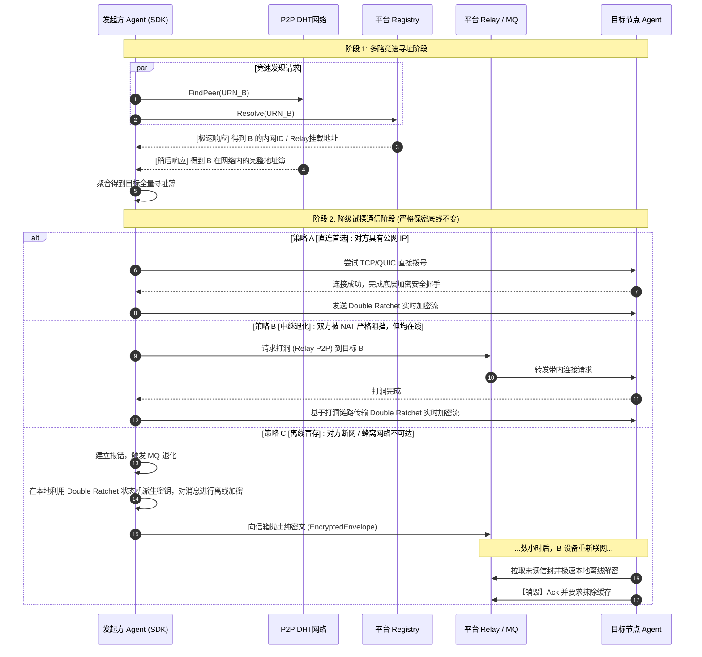

# Agent Comm Skill: SDK & Integration Design

本文档定义了 `agent-comm` 系统在应用侧与终端的封装层设计，即 `Agent Comm Skill`。其目的是抹平底层 libp2p 网络、Double Ratchet 密码学与状态机的复杂性，赋予 AI Agent 面向应用的、开箱即用的加密通信能力。

## 1. 核心特性：自适应降级与竞速寻址

为了保障极高连通率的同时坚守去中心与端到端安全的底线（Hybrid P2P），SDK 内置了智能的网络路由和竞速诊断能力。

### 1.1 节点环境自适应 (AutoNAT Based)
SDK 初始化时，将探测宿主的网络边界能力：
- **作为全网 Full Node（拥有公网 IP）**：监听公网端口，主动加入 Kademlia DHT 路由，接受全网的点对点高优直连，也可配置为本地联邦的临时节点。
- **作为边缘 Client Node（受限 NAT）**：自动执行 fallback，主动向指定的平台（或私有自建平台）发出长连，挂载到可信的 Relay v2 节点及超级 Registry 网关上。

### 1.2 寻址与投递流转 (Fallback Protocol)
SDK 向调用者屏蔽了寻找对端和建连的纠结过程，仅暴露出简单逻辑，内部自动执行：
1. **寻址竞速**：同时向 DHT 网络和 平台超级 Registry 抛出目标 `URN`。最快返回的线路胜出。
2. **阶梯降级投递**：
   - 优选：直接尝试 TCP/QUIC 拨号建立纯净 P2P 的 Double Ratchet 流。
   - 降级一：拨号不通，通过平台 Relay 链路发起中继握手。
   - 降级二：报网络不可达，通过 Double Ratchet 计算出本次密文，打进加密信封（Env）丢给平台 MQ 盲存。

## 2. 开发者集成 API 与端侧联动

### 2.1 高阶调用封装
对外不再暴露底层的 `Ed25519` 与 `X25519` 密钥管理和轮转，而是提供更人类友好的交互 API：
- `agent.InitIdentity(config)`：负责按配置选取自建网络或官方平台，自动挂载底层的身份轮换与 Sqlite 初始化。
- `agent.SendMessage(urn, text)`：处理上面提到的竞速、打洞、盲存。
- `agent.OnMessage(callback)`：持续消费收到的会话。

### 2.2 信任绑定与 UI 侧联动 (基于 Phase 4a 简化)
加密协议的最根本弱点在握手前被中间人欺骗。Skill 层将和端侧用户界面（如小程序、大屏端）协同：
- 生成可视化身份信息（URN/指纹的快速复制或二维码生成）。
- 用户通过扫码交叉验证对方真实公钥指纹，在本地构建绝对可信通讯录。

## 3. 架构与流程图

### 3.1 混合降级路由通讯流程

### 3.2 Hybrid 联邦网络集成

SDK 允许替换硬编码的官方平台：
- 配置自定义 `bootstrap_peers` 和 `mq_relays` 以切入 100% 隔离的私有自治网。
- 实现与其它平台的联动互通（通过联邦路由打通底层流）。

## 4. 后续开发规划

1. **工程壳 (Wrapper) 实现**：开发 Go 语言层面的顶级 `Agent` 结构，将现存的 Phase 1 到 Phase 6 所有组件整合为统一的状态机。
2. **离线退化逻辑硬通配**：重点编码“流拨号失败后自动转入 MQ 盲存构建器”的链路切换错误处理机制。
3. **暴露 FFI / C绑定 (选做)**：若目标不仅限于 Go 环境 Agent，可考虑编译为不同语言易用的底层 Native SDK 以支持 Python/Node 的广泛接入。