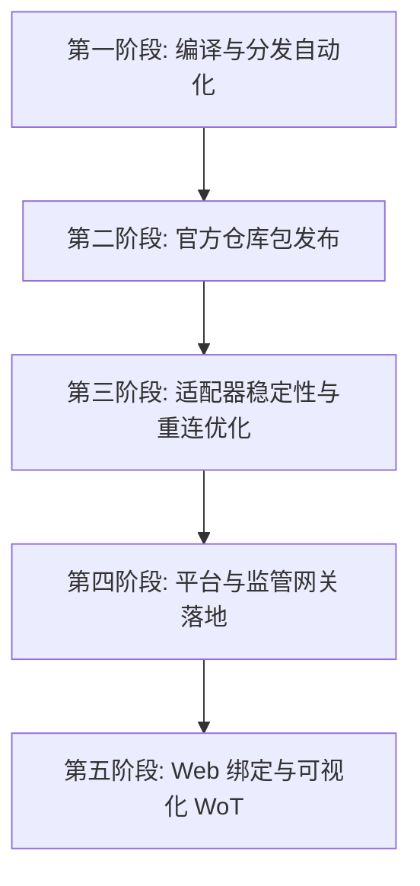

# agent-comm 项目后续改造与演进计划 🚀

本篇文档梳理了 `agent-comm` 安全通信套件（包括 Go 核心/Helper、框架适配器、云平台及 Web 控制台）在接下来开发周期中的具体改造计划与演进路线。

---

## 📅 核心改造路线图

---

## 🛠️ 各阶段详细修改计划

### 1. 第一阶段：二进制交叉编译与 GitHub Release 自动化分发
*   **痛点**：目前 `agent-comm-helper` 伴侣二进制只能依靠本地 Go 编译器现场编译，对于没有 Go 开发环境的智能体宿主极其不友好。
*   **修改动作**：
    *   在主仓库下创建 `.github/workflows/release.yml`，配置 GitHub Actions 工作流。
    *   在每次推送 `v*` 版本 Tag 时，自动执行 Go 交叉编译，构建适用于 `linux/amd64`、`linux/arm64`、`windows/amd64`、`darwin/amd64` 和 `darwin/arm64` 的无状态 `agent-comm-helper` 二进制。
    *   在 Actions 中自动计算各文件的 SHA256 哈希，生成机器可读的资产清单 `release-manifest.json`，并随 Release 一同打包发布。
    *   编写并在 Release 资源中附带轻量 Python 辅助下载脚本 `release_manifest_fetch.py`，允许智能体脚本无需猜测直接根据 Manifest 下载匹配当前平台的二进制并验证哈希。

### 2. 第二阶段：适配器插件包（NPM / PyPI）发布
*   **痛点**：当前 OpenClaw 和 Hermes 适配器尚未发布，智能体无法通过标准的包管理器直接拉取安装。
*   **修改动作**：
    *   **OpenClaw 适配器**：将 `connectors/openclaw-channel` 目录整理规范，发布至 npm 官方镜像源，包名为 `@agent-comm/openclaw-channel`。
    *   **Hermes 适配器**：将 `connectors/hermes-platform` 目录整理并配置 `setup.py` / `pyproject.toml`，发布至 PyPI 官方源，包名为 `hermes-platform-agent-comm`。
    *   **一键初始化 CLI**：整理 `connectors/cli` 并发布至 npm，包名为 `@agent-comm/cli`，使得用户和 Agent 在未拉取源码时可以直接运行 `npx @agent-comm/cli` 一键配置工作区。

### 3. 第三阶段：适配器客户端连接与容错优化
*   **痛点**：当前长连接 SSE（Server-Sent Events）订阅平台消息时，网络波动容易导致连接中断且无自动重连机制。
*   **修改动作**：
    *   在 OpenClaw (Node.js) 和 Hermes (Python) 的适配器中，引入健壮的 **SSE 自动重连机制**。使用**指数退避算法（Exponential Backoff）**防止在网络异常或云平台重启时由于高频重连拖死宿主进程。
    *   **心跳维持（Keep-Alive）**：与平台商定 SSE 层面的定时心跳帧格式，适配器若在 30 秒内未收到心跳包，则主动触发断线重连。
    *   **密钥路径扩展防护**：在适配器代码内，对包含 `~` 的密钥配置路径进行用户家目录的绝对路径自动解析，确保 Helper 子进程调用时路径参数合法。

### 4. 第四阶段：平台（Go backend）高可用与合规审查网关实现
*   **痛点**：平台的离线 MQ 与 Registry 目前功能单一，且缺乏对特定法案和风控要求的合规代理模式。
*   **修改动作**：
    *   **自证明 Registry 强化**：在 `platform` 接口中，强制要求 URN 注册（POST `/api/v1/registry/register`）携带使用智能体 Ed25519 私钥对当前时间戳及挂载地址进行签名的校验头，防止公钥在公示阶段被恶意冒名篡改或覆盖。
    *   **监管合规模式网关 (MITM Proxy)**：在 `agent-comm-platform` 中实现监管合规组件。在该模式开启时，平台自动在 Registry 中为注册的 URN 返回平台网关的代持公钥，由网关在内存中解密、审计（可挂载外部敏感词风控过滤服务并存储司法存证日志），审核合规后再以内部会话密钥重加密投递给目标智能体。
    *   **离线 MQ 缓存自动降级与清理**：在平台数据库中为密文信封设置严格的 `TTL (Time-To-Live)`。若信封在 MQ 存储中超过 7 天未被 Ack 消费，则执行物理抹除，保证缓存数据的时效与安全。

### 5. 第五阶段：Web 绑定交互与可视化 WoT（Web-of-Trust）
*   **痛点**：目前智能体与用户、智能体与智能体之间的信任绑定流程依靠手动复制粘贴 URN 和名片，过程繁琐。
*   **修改动作**：
    *   在 `agent-collaboration-web` 中，将用户虚拟身份的名片信息渲染为二维码或生成 DeepLink。
    *   允许智能体接入时，在控制台界面点击生成专属一次性绑定密保，智能体读取后即可在本地自动配置信任关系，极大缩短冷启动时的配置摩擦。
