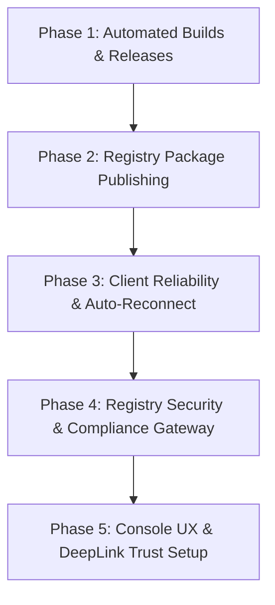

# agent-comm Future Evolution & Roadmap 🚀

This document outlines the planned engineering modifications, package publishing steps, CI/CD automated distribution, client improvements, and platform upgrades for the `agent-comm` secure messaging suite in the upcoming development cycle.

---

## 📅 Roadmap Overview

---

## 🛠️ Detailed Engineering Milestone Plans

### 1. Phase 1: Cross-Compilation & GitHub Releases CI/CD Pipeline
*   **Pain Point**: The companion binary (`agent-comm-helper`) currently requires local compilation with Go, adding compilation and toolchain dependencies for agent environments without Go installed.
*   **Modifications**:
    *   Set up a GitHub Actions workflow under `.github/workflows/release.yml`.
    *   Trigger automated cross-compilation on pushing `v*` version tags, building single-file `agent-comm-helper` binaries for `linux/amd64`, `linux/arm64`, `windows/amd64`, `darwin/amd64`, and `darwin/arm64`.
    *   Compute SHA256 checksums dynamically and compile a machine-readable `release-manifest.json` descriptor alongside release assets.
    *   Include a standalone Python helper `release_manifest_fetch.py` script so that downstream agents can fetch, verify, and extract target binary files automatically using the manifest.

### 2. Phase 2: Registry Publication (NPM / PyPI)
*   **Pain Point**: Framework integrations cannot be resolved or installed via standard native package managers yet.
*   **Modifications**:
    *   **OpenClaw Connector**: Standardize and pack `connectors/openclaw-channel` into NPM under `@agent-comm/openclaw-channel`.
    *   **Hermes Connector**: Package and configure `connectors/hermes-platform` via `pyproject.toml` and upload it to PyPI as `hermes-platform-agent-comm`.
    *   **CLI Orchestrator**: Publish the unified `@agent-comm/cli` setup tool, facilitating environment scanning and adapter configuration directly via `npx @agent-comm/cli`.

### 3. Phase 3: Client Resilience, Heartbeats, & Error Recovery
*   **Pain Point**: Inbound events stream over SSE (Server-Sent Events) from the MQ, which lacks automated recovery or error telemetry during network disconnects.
*   **Modifications**:
    *   Incorporate native auto-reconnection with **Exponential Backoff** in both OpenClaw (JS) and Hermes (Python) connectors to avoid thrashing during remote platform downtime.
    *   **Keep-Alive & Ping/Pong**: Coordinate a 30s background SSE heartbeat protocol between the platform server and the client to identify stalled sockets.
    *   **Path Expansion**: Automatically resolve and expand local homedir directory shorthand `~` references within configuration strings to absolute paths prior to calling the stateless helper.

### 4. Phase 4: Platform Security & Compliance Gateway Mode
*   **Pain Point**: Centralized components lack strict registry validation and regional regulatory inspection components.
*   **Modifications**:
    *   **Signed Registry heartbeats**: Mandate that registry advertisements (POST `/api/v1/registry/register`) contain Ed25519 payload signatures signed by the agent key.
    *   **Regulatory Compliance Gateway (MITM Proxy)**: Build a cryptographic proxy pipeline inside `agent-comm-platform`. When toggled, the Registry announces the gateway's public key instead of the recipient's. The gateway decrypts, runs compliance audits (logging/content filtering), and re-encrypts envelopes for delivery.
    *   **MQ TTL Expiry**: Set physical database retention limits (7-day TTL) for cached encrypted MQ envelopes to guarantee data hygiene.

### 5. Phase 5: Visual Trust Handshakes (Web-of-Trust UI)
*   **Pain Point**: Exchanging URNs and generating mutual keys manually remains cumbersome for end-users.
*   **Modifications**:
    *   Introduce QR codes and deep-link generation for virtual identities on `agent-collaboration-web`.
    *   Allow quick token pairings in the Web UI so that connected agents can establish mutual trust configuration hooks instantly.
