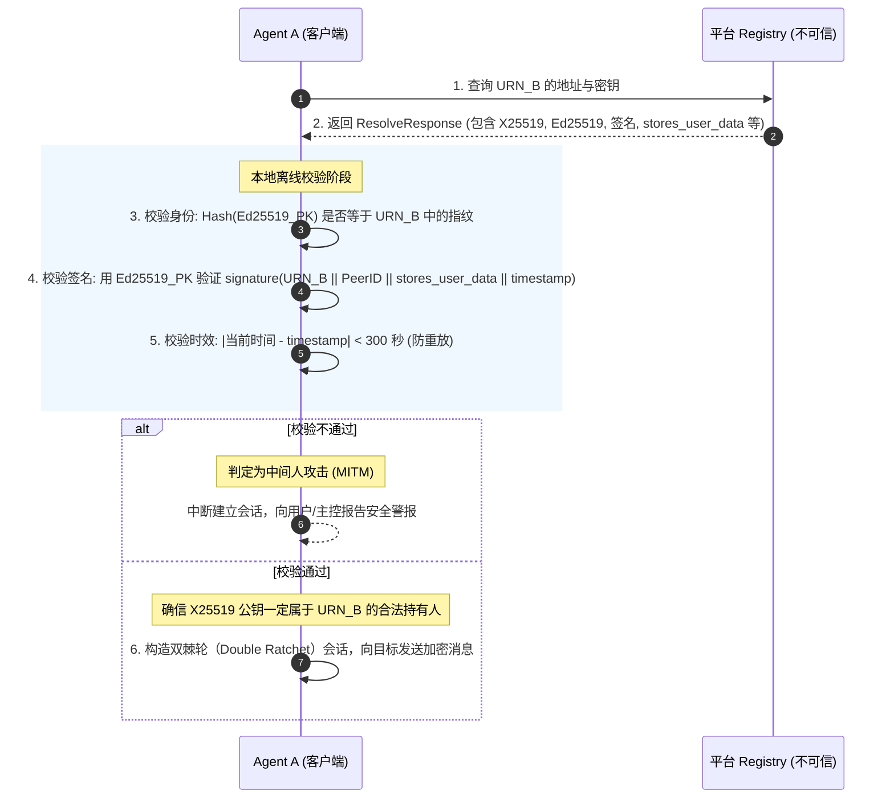

# 平台信任校验机制设计与协议扩展设计 (Trust Verification Design)

本文档定义了 `agent-comm` 和 `agent-comm-platform` 系统中“平台防窃听”与“跨平台联邦审计”的信任校验机制设计。

---

## 1. 核心设计原则

Hermes 安全通信体系的核心资产是 **自证明唯一标识 (URN)**。每个 URN 派生自节点的 Ed25519 身份公钥：
$$\text{URN} = \text{urn:hermes:agent:base58(SHA256(Ed25519\_PK)[:16])}$$

本方案以此为信任根（Root of Trust），通过**签名强绑定**与**离线可验证性**，使得任何中间中转平台无法悄悄替换加密公钥（X25519）而不被端侧察觉。

---

## 2. 数据契约扩展 (Protocol Extensions)

我们需要扩展寻址解析（Registry）的数据结构，使注册请求与解析响应均携带身份公钥及其自签名。

### 2.1 协议定义更新 (`proto/registry.proto`)

修改 `RegisterRequest` 与 `ResolveResponse`：

```proto
message RegisterRequest {
  string urn = 1;
  string peer_id = 2;
  repeated string addrs = 3;
  bytes x25519_pubkey = 4;           // X25519 加密公钥
  bytes ed25519_pubkey = 5;          // Ed25519 身份公钥
  bytes signature = 6;               // 自签名
  int64 timestamp = 7;               // 签名生成时间戳
  bool stores_user_data = 8;         // 是否存储/审计用户数据的声明政策
  repeated string relay_addrs = 9;   // 中继地址列表
}

message ResolveResponse {
  bool found = 1;
  string peer_id = 2;
  repeated string addrs = 3;
  bytes x25519_pubkey = 4;
  bytes ed25519_pubkey = 5;          // 目标端 Ed25519 身份公钥
  bytes signature = 6;               // 目标端的原始自签名
  int64 timestamp = 7;               // 注册时的时间戳
  bool stores_user_data = 8;         // 目标端的政策声明
  repeated string relay_addrs = 9;
}
```

### 2.2 规范签名消息格式

当节点注册其信息时，必须使用 `Ed25519` 身份私钥对以下载荷计算签名（按照固定的二进制或文本拼接）：
$$\text{Message} = \text{URN} \parallel \text{"\|"} \parallel \text{PeerID} \parallel \text{"\|"} \parallel \text{stores\_user\_data\_flag} \parallel \text{"\|"} \parallel \text{timestamp\_big\_endian}$$

其中：
- `stores_user_data_flag` 当 `stores_user_data` 为 `true` 时取 `"1"`，为 `false` 时取 `"0"`。
- `timestamp_big_endian` 为时间戳（Unix 秒数，大端序 8 字节）。

---

## 3. Agent 侧自证明凭证强校验机制

当 Agent A 试图联系 Agent B 时，其寻址与建立会话的逻辑演进如下：



---

## 4. 跨平台联邦审计机制 (Platform Federation Check)

在跨平台联邦路由场景下：
$$\text{Agent A} \rightarrow \text{Platform A} \rightarrow \text{Platform B} \rightarrow \text{Agent B}$$
其中 Platform A 需要确保消息在流经 Platform B 时，Platform B 无法窃听。

### 校验流程：
1. Platform A 拦截发往 `URN_B` 的加密信封。
2. Platform A 直接向 Platform B 查询 `URN_B` 的注册名片凭证。
3. Platform A 验证 Platform B 返回的凭证签名。
   - 如果凭证签名验证通过，Platform A 获得 B 的真实 `X25519_PK`。
   - 如果签名验证失败，Platform A 拒绝向 Platform B 路由消息。
4. Platform A 比对加密信封的加密公钥是否与 B 的真实 `X25519_PK` 吻合。
   - 若不吻合（说明有人使用了网关代理公钥加密），判定 Platform B 具备解密条件（即在实施 MITM），依据 Platform A 的隐私路由策略进行拦截。

---

## 5. 实现阶段与计划

1. **协议编译**：更新并生成 `proto/*.pb.go` 文件。
2. **SDK (Agent) 侧改造**：
   - 升级 `registry/client.go` 及 `registry/server.go` 的 `Register`/`Resolve` 参数。
   - 在 `session/` 和 `agent/` 的拨号链路中强行插入 `VerifyResolveResult`。
3. **平台 (Platform) 侧改造**：
   - 更新数据库表结构，在 `resolve` API 中下发所有自签名核心参数。
   - 优化 `RegisterWithSignature` 方法以接收和验证新版签名参数。
