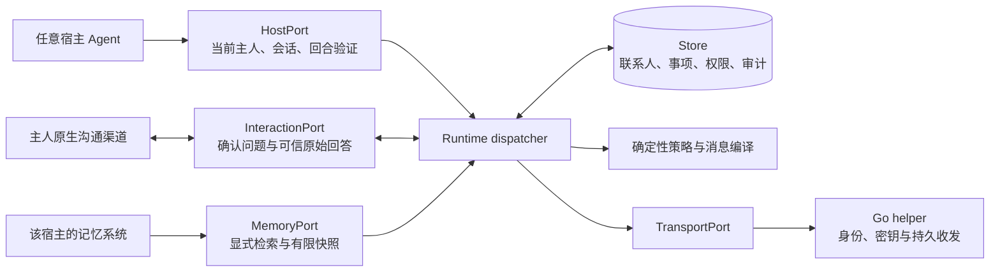
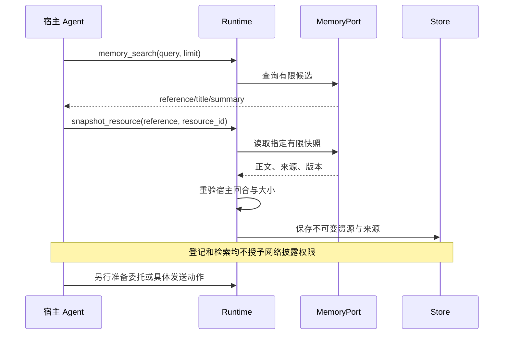

# Agent Comm 本地协作 Runtime

`agent-comm-runtime` 0.1.0 是可独立安装的 Python 3.11+ 包，标准库即可运行。它不导入 Hermes、模型 SDK 或任何记忆库。联系人、授权、任务、不可变动作、资源快照、入站和审计的唯一实现位于这里；Hermes connector 是它的首个实际宿主适配器。Web 通过明确配对的远程控制协议读取 agent 侧状态，不另建一份联系人或事项主库。

## 安装与独立运行

在 SDK 根目录运行，使用目标宿主的实际 Python：

```sh
python -m pip install ./python
python -m agent_comm_runtime.reference --demo
python -m unittest discover -s python/tests -v
```

`--demo` 使用临时 SQLite 与少量示例资料，演示能力发现、状态查询、有限记忆检索和资源登记，不发信、不产生授权。交互式参考宿主可用：

```sh
python -m agent_comm_runtime.reference --state ./collaboration.sqlite3
```

输入 `{"action":"describe"}`、`{"action":"state"}` 等 JSON。确认发生在同一进程的独立文字问题内，必须使用本地主人的交互终端。不要把该进程的标准输入接到模型输出或远端消息。`--helper-url` 和 `--memory-json` 都只有显式传入才启用对应适配器。

源码运行尚未安装时把 SDK 的 `python/` 加入 `PYTHONPATH`。Hermes 插件开发测试还需要 Hermes 源码路径；安装后的发行包不需要修改 `sys.path`。

## 系统边界



扩展协议版本 `1.0`、Python 包版本 `0.1.0`、协作消息 `agent-comm-collaboration/v1`、SQLite schema `1` 是不同版本维度。当前 adapter API 要求版本精确相同；未来改变合约时显式升级，避免静默兼容猜测。原 Hermes 协作数据库无需迁移，原 `hermes-native-<profile hash>` 主体仍能读取旧记录。

## 已实现的扩展端口

端口定义、注册验证和实际调用分别在 [ports.py](agent_comm_runtime/ports.py)、[runtime.py](agent_comm_runtime/runtime.py)。端口是代码接口，不是向网络开放的 TCP 监听端口。

| Port | 能力名与方法 | 核心必须得到的保证 |
|---|---|---|
| HostPort | 必需 `owner_context`: `capture(context)` / `revalidate(session)` | context 来自宿主持有的可信对象；稳定 principal、临时 session 和 turn 分开；关闭、换回合、代执行者变更后拒绝旧操作 |
| HostPort | 可选 `wake`: `wake(session, task_id)` | 宿主自己决定如何安全恢复事项；当前 Hermes 未实现，不自动启动后台私人 LLM |
| MemoryPort | 可选 `search(session, query, limit)` | 必须显式 query，1–20 条候选；只返回 reference/title/summary，不自动绑定网络身份 |
| MemoryPort | 可选 `read_snapshot(session, reference, max_chars)` | 按明确 reference 返回不可变有限文本、来源与版本；1–8000 字符，不完整则拒绝或让调用方另选更小记录 |
| InteractionPort | 可选 `confirmation`: `request_confirmation(session, question)` | 展示确切完整问题；返回该问题的主人原始回答；不能让模型传入 approved 或答案；不支持时明确返回 unsupported |
| InteractionPort | 可选 `notification`: `notify(session, text)` | 宿主自行实现通知渠道；由可信调度代码显式调用，不因收件自动执行 |
| TransportPort | 可选 `durable_mailbox`: `store(body)` / `retrieve()` / `ack(message_ids)` | 身份验证由可信客户端完成；稳定 message_id、先持久接管后 ACK；HelperTransport 为已实现的本机 HTTP 适配 |

`HostSession(principal_id, session_id, turn_id, opaque=...)` 中 `opaque` 保留实际宿主句柄，不序列化给模型。核心拒绝模型参数中的 owner/context/raw_response 等额外字段。不同原生对话可共用同一 profile principal；不同人的 profile 必须使用不同主体及实际隔离边界。

`AdapterRegistry.register(adapter)` 验证版本、端口、能力与对应可调用方法；同一 registry 不允许替换已注册端口。未知能力和缺失方法立即报错。`registry.require`、`registry.invoke` 对未注册能力返回 `Unsupported`，不自动选择其它渠道、不自动降为通用文本执行。`Runtime.dispatch` 将不可用扩展稳定返回 `{"status":"unsupported",...}`。

可选的 wake/notification 通过可信宿主代码的 `registry.invoke(port, capability, method, ...)` 调用。公共模型 action 不包含任意 method 调用。当前没有通用后台调度器，声明接口不会让 agent 自动具备后台推进能力。

## 实际注册与调用

[reference.py](agent_comm_runtime/reference.py) 是完整可运行参考实现，可替换 TerminalHost、TerminalInteraction、FiniteMemory 中任意一项。最小装配如下：

```python
from agent_comm_runtime import AdapterRegistry, Runtime, Store
from agent_comm_runtime.reference import TerminalHost, TerminalInteraction
from agent_comm_runtime.transport import HelperTransport

host = TerminalHost("./owner-profile")
registry = AdapterRegistry().register(host).register(TerminalInteraction())
registry.register(HelperTransport("http://127.0.0.1:45042"))
store = Store("./owner-profile/collaboration.sqlite3", local_urn="urn:agent-comm:agent:YOUR_ID")
try:
    runtime = Runtime(store, registry)
    result = runtime.dispatch({"action": "state"}, context=host.begin_turn())
finally:
    store.close()
```

生产宿主应把 `host.begin_turn()` 换成其真实会话上下文，传参由宿主 driver 完成，模型不得提供 context。

Runtime 已提供 `describe`、`state`、`inbox`、联系人解析/准备、资源登记、任务/动作准备、原生确认、发送、撤销、提议导入，以及 `memory_search`、`memory_snapshot`、`snapshot_resource`。`describe` 同时返回支持的业务能力和已注册端口；列出 action 不意味着其所需的可选端口已安装。

## 为 Hermes 增加自己的记忆适配器

不要求统一数据库或知识图谱。第三方包提供显式 entry point 工厂，例如其 `pyproject.toml`：

```toml
[project.entry-points."agent_comm_runtime.adapters"]
my-graph = "my_graph_adapter:create"
```

`create(options: dict)` 返回带 `Descriptor("my-graph", "memory", ("search", "read_snapshot"))` 的 adapter。它只读取当前 HostSession 获准的记忆来源，不接受任意模型传入文件路径或数据库连接串；返回结构参见 `MemoryPort` 与 `MemorySnapshot`。模块名称、配置文件位置和凭据由主人安装配置指定。

在 Hermes 实际 profile 合并：

```yaml
platforms:
  agent_comm:
    extra:
      collaboration_enabled: true
      collaboration_memory_adapter:
        name: my-graph
        options:
          selected_collection: collaboration
```

Hermes 只加载明确选择的这一个 memory entry point，重名、未安装、版本不匹配或实现了错误端口均拒绝。默认没有记忆 adapter；agent 仍可按平常方法理解有限上下文并使用 `register_resource`。安装 adapter 是授予本地 Python 代码的信任，注册合约本身不审查任意第三方代码。



不存在 `export_all` 或默认写回记忆动作。对端消息保持 `peer_statement_not_owner_authority`，不会自动变成记忆里的主人指令或可信事实。网络 URN 与记忆中人的称呼仍通过独立、原生确认的联系人绑定连接。

URN 语法由 [identity.py](agent_comm_runtime/identity.py) 统一处理，不根据命名空间猜测权限。已有 Web 身份 `urn:hermes:agent:<fingerprint>`、SDK 默认 `urn:agent-comm:...` 及自选合法命名空间均保留；接入时不重命名旧身份、不旋转密钥。语法校验不等于身份认证，公钥到 URN 的对应关系和签名由 helper/传输层验证。

## 实现新宿主或确认渠道的检查点

1. 先实现 HostPort，用真实宿主身份对象建立稳定 principal，并测试 remote/delegated/取消回合不能冒用。
2. 实现 InteractionPort，让原生渠道返回具体问题的真实回答；核心保存私有 token，模型只有 approval_id。回调后重新校验同一会话、回合、事项和动作版本。
3. 按需提供 MemoryPort，不读取整库作为注册副作用。使用确定 reference、来源、版本、全文大小上限；未知网络身份只作为候选，不自动建联系人。
4. 接上持久 helper TransportPort，区分本机接受、云端排队、对端收件和业务同意。协作模式的入站持久保存后由主人会话继续。
5. 运行 contract suite，并加上宿主真正的 UI/session 回调测试。Protocol 类型检查和示例终端的通过不能替代真实宿主验证。

新增业务能力需要明确 schema、策略、问题全文、确定性编译与副作用恢复语义；在 descriptor 列出任意能力名不会取得该能力。当前没有日历写入、支付或通用操作系统执行。

## 兼容与远程控制

Hermes 的 `collaboration/policy.py`、`store.py`、`transport.py` 仅保留薄的兼容 import；没有第二份实现或独立状态。其 `collaboration/hermes.py` 只保留原生身份验证、InteractionPort、配置、工具 schema 与技能装配。

`control.request` / `control.response` 由独立显式配对的 remote bridge 消费。普通协作 inbox 对这些类型拒绝落盘和 ACK，防止与主人远程通道抢消费。配对授予的工作台方法不会自动变成某个联系人或远端 agent 的主人权限。远程 RPC 与宿主适配器的具体可用能力应以 agent 返回的 capability descriptor 为准。

远程控制请求最多 50,000 UTF-8 字节，JSON 容器嵌套最多 32 层；超限消息保持未确认，
由当前消息的错误处理隔离，不会终止整个邮箱消费进程。
